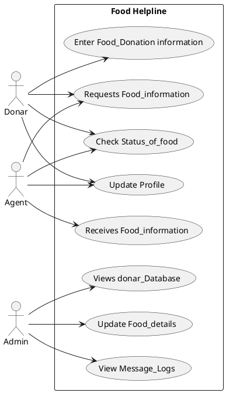
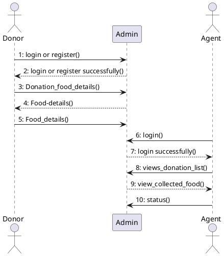
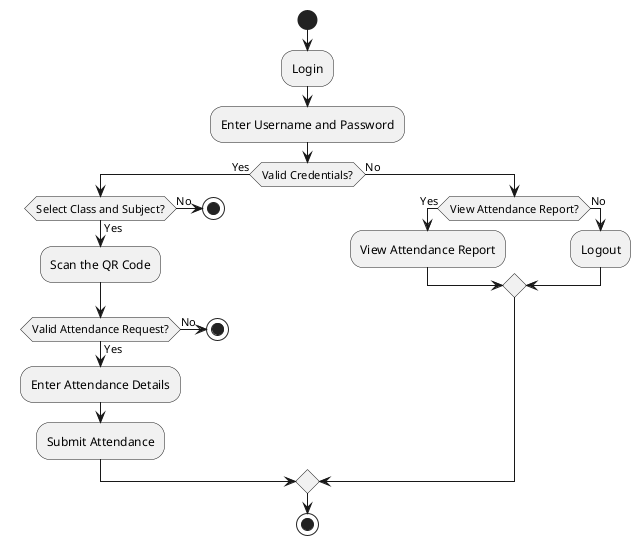
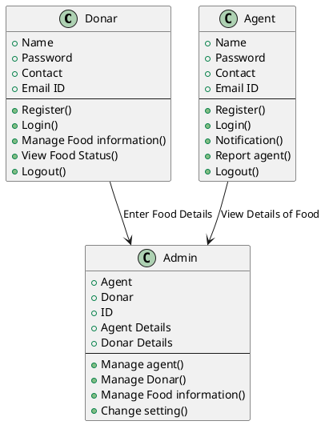
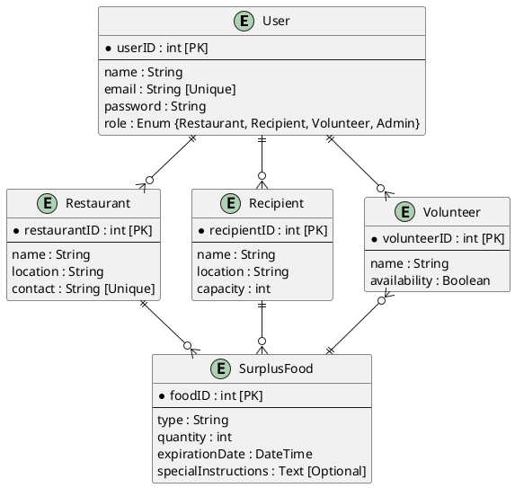
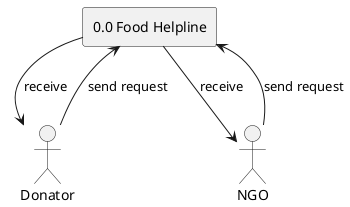
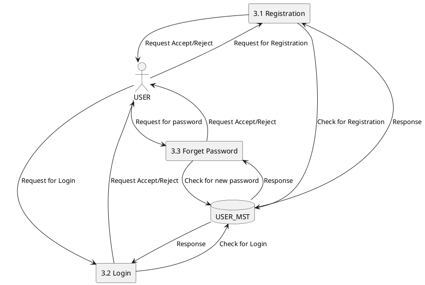
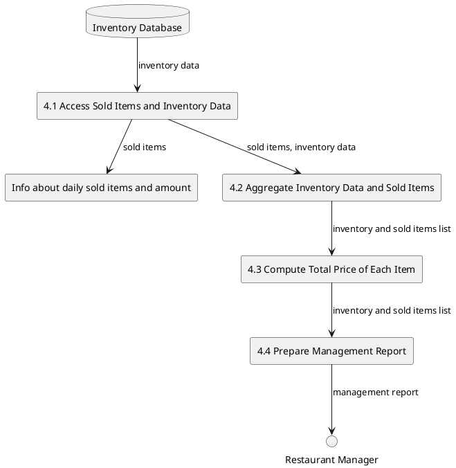

# Food Helpline

**Guide:** Prof. Amit Solanki\
**Team Members:**

- Mr. Vishal Patel (23172012020)
- Mr. Nayka Shreyash (23172012010)
- Mr. Divy Patel (23172022014)

## **Introduction**

Food waste is a growing problem, especially when many people struggle to get enough to eat. The **Smart Food Redistribution Platform** aims to bridge this gap by connecting restaurants with NGOs and food banks. This platform enables restaurants to donate excess food, while distributors facilitate its delivery to those in need.

### **Problem Definition**

Every day, significant amounts of surplus food from restaurants go to waste, while many families face food insecurity. Food waste is a critical environmental issue, leading to unnecessary resource consumption and pollution.

### **Proposed Solution**

- Minimize food waste by redirecting surplus food to those in need.
- Improve inefficient and uncoordinated current redistribution methods.
- Enhance logistical coordination to optimize food distribution.

## **Functional Requirements**

- **User Types:** Support different user types (restaurants, food banks, shelters, volunteers, administrators).
- **Surplus Logging:** Restaurants can log surplus food with details like type, quantity, expiration date, and handling instructions.
- **Recipient Matching:** The system automatically matches surplus food with recipient organizations based on location and capacity.
- **Responsive Design:** Accessible via both mobile devices and web browsers.
- **Pickup Scheduling:** Enables scheduling of food pickups.

## **Non-Functional Requirements**

- **Response Time:** User interactions (e.g., logging food, scheduling pickups) should respond within 2 seconds.
- **Uptime:** The system must ensure a minimum of 99.9% uptime.
- **User Interface:** The platform should be user-friendly, with intuitive navigation for all users.
- **Data Encryption:** Secure data using AES-256 encryption (both in transit and at rest).

&nbsp;

## **UML Diagrams**

#### **Use Case Diagram**

#### **Sequence Diagram**

#### **Activity Diagram**

#### **Class Diagram**

#### **Entity-Relationship (ER) Diagram**

---

#### **Data Flow Diagrams**

##### **Level-0 DFD**

##### **Level-1 DFD**

##### **Level-2 DFD**

## **Conclusion**

The **Food Helpline** is a crucial initiative addressing both food waste and food insecurity. By efficiently redistributing surplus food, the platform helps mitigate environmental impact while ensuring vulnerable populations have access to nutritious meals. Key components such as effective communication, stakeholder collaboration, logistics management, and community outreach drive the success of this project.

By integrating sustainability practices and feedback mechanisms, the helpline can continuously improve, adapting to evolving community needs
