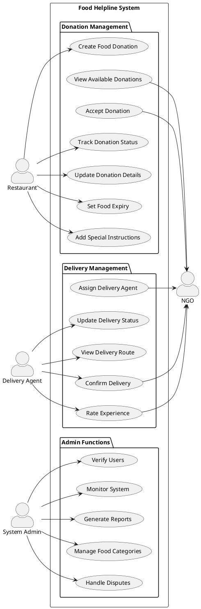
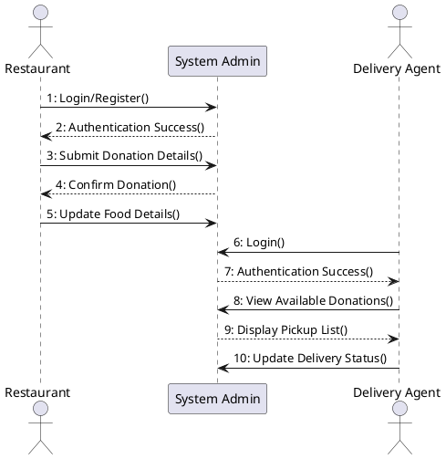
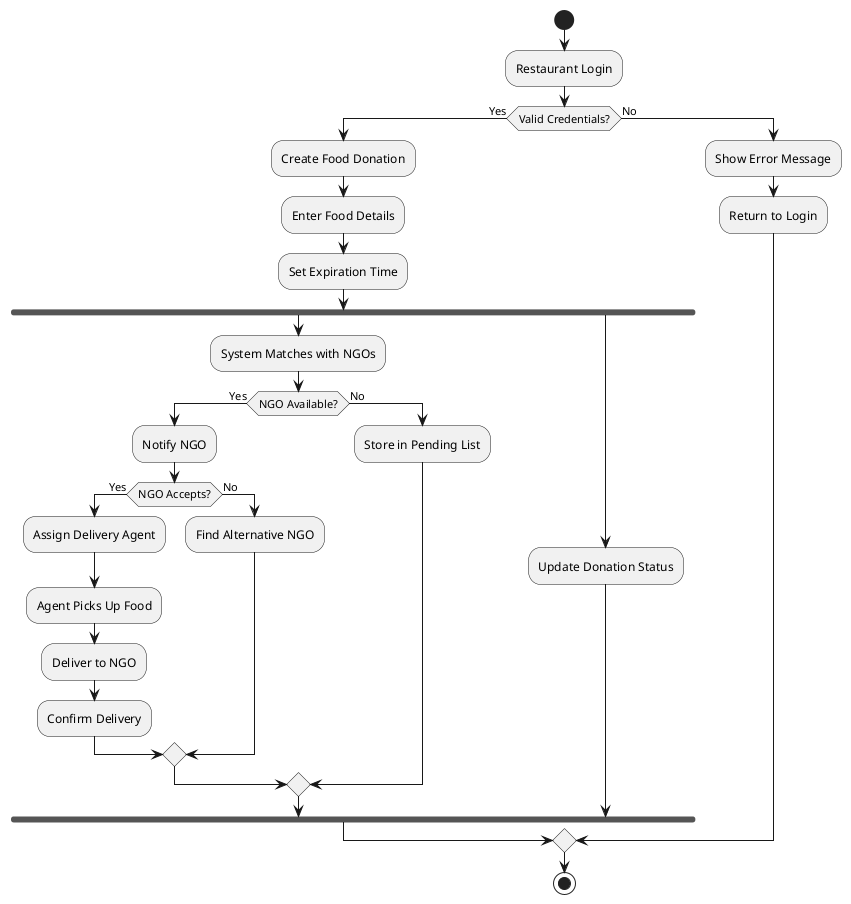
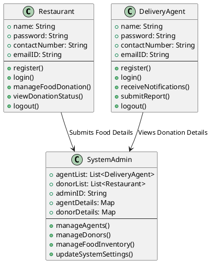
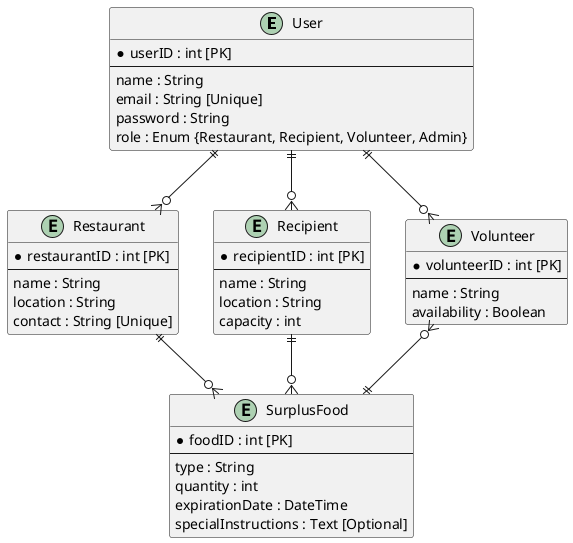
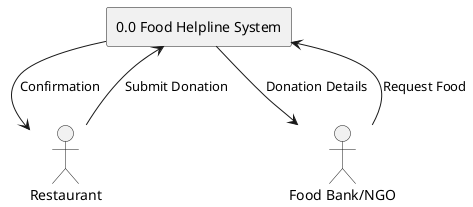
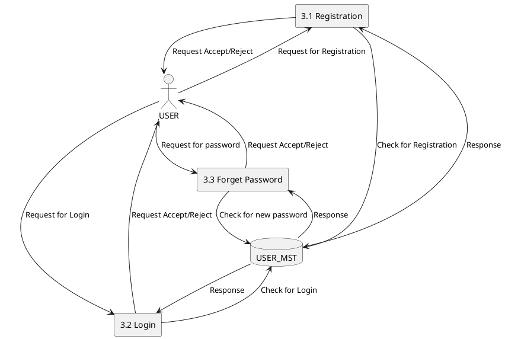
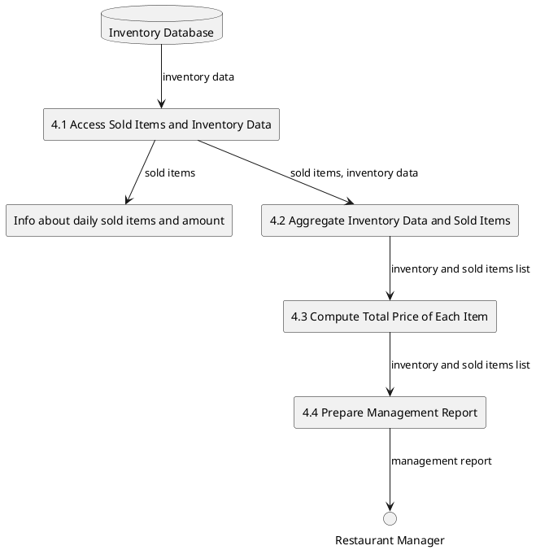

# Food Helpline

**Guide:** Prof. Amit Solanki\
**Team Members:**

- Mr. Vishal Patel (23172012020)
- Mr. Nayka Shreyash (23172012010)
- Mr. Divy Patel (23172022014)

## **1. Introduction**

### **1.1 Purpose**

The Food Helpline system aims to reduce food waste and address food insecurity by creating an efficient platform connecting restaurants with surplus food to NGOs and food banks.

### **1.2 Project Scope**

- Digital platform for food donation management
- Real-time coordination between restaurants, NGOs, and delivery agents
- Food waste reduction tracking and impact measurement
- Secure and efficient food redistribution system

## **2. System Requirements**

### **2.1 User Types**

1. **Restaurants (Donors)**

   - Profile management
   - Food donation creation and tracking
   - Donation history access
   - Real-time status updates

2. **NGOs (Recipients)**

   - Profile and capacity management
   - Donation request and acceptance
   - Delivery scheduling
   - Food receipt confirmation

3. **Delivery Agents**

   - Profile and availability management
   - Pickup/delivery assignment acceptance
   - Route information access
   - Delivery status updates

4. **System Administrators**
   - User verification and management
   - System monitoring
   - Issue resolution
   - Report generation

### **2.2 Functional Requirements**

#### **2.2.1 Food Donation Management**

1. **Donation Creation**

   - Multiple food items per donation
   - Detailed food categorization (cooked, packaged, produce, dairy, grains)
   - Quantity with standardized units (kg, items, servings, liters)
   - Nutritional information tracking
   - Allergen information
   - Preparation and expiry time tracking
   - Special handling instructions
   - Packaging details

2. **Donation Matching**

   - Location-based NGO matching using geospatial queries
   - NGO capacity verification
   - Service area compatibility
   - Time window compatibility
   - Food type suitability
   - Multiple food items handling

3. **Status Tracking**
   - Enhanced status workflow (pending → matched → assigned → picked_up → delivered)
   - Digital proof of delivery (signatures and photos)
   - Dispute resolution system
   - Rating system for all participants

#### **2.2.2 User Management**

1. **Registration & Authentication**

   - Role-based user types (restaurant, NGO, delivery agent, admin)
   - Enhanced verification process
   - Multi-language support (English, Hindi, Gujarati)
   - Status management (pending, active, suspended)

2. **Profile Management**
   - Business details for restaurants
   - Registration numbers for NGOs
   - Vehicle information for delivery agents
   - Operating hours
   - Service area management
   - Capacity specifications

### **2.3 Non-Functional Requirements**

#### **2.3.1 Performance**

- Geospatial queries optimization
- Efficient multi-item donation handling
- Real-time status updates
- Optimized database indexing

#### **2.3.2 Security**

- Secure user authentication
- Data encryption
- Privacy protection
- Regular security audits

#### **2.3.3 Reliability**

- System uptime: 99.9%
- Data backup: Daily
- Error recovery mechanisms
- Fault tolerance

#### **2.3.4 Usability**

- Intuitive interface
- Mobile responsiveness
- Minimal training required
- Multi-language support (English, Hindi, Gujarati)

## **3. System Features**

1. **User Registration & Authentication**

   - Role-based registration
   - Email verification
   - Profile completion

2. **Donation Management**

   - Create donations
   - Track status
   - Update/cancel donations
   - View history

3. **Assignment System**
   - Automatic NGO matching
   - Delivery agent assignment
   - Route optimization
   - Status updates

## **4. System Constraints**

### **4.1 Technical Constraints**

- Internet connectivity required
- Mobile device compatibility
- Browser compatibility
- Storage limitations

### **4.2 Business Constraints**

- Food safety regulations
- Transportation regulations
- Time-sensitive operations
- Geographic limitations

## **5. Success Metrics**

- Number of successful donations
- Amount of food saved
- Number of active users
- Average matching time
- Delivery success rate
- User satisfaction ratings

## **6. Future Enhancements**

- Integration with food safety monitoring systems
- Advanced analytics dashboard
- Mobile application development
- Community engagement features
- Gamification elements

## **7. Conclusion**

The Food Helpline system provides a crucial platform for efficient food redistribution, helping reduce waste while addressing food insecurity in the community.

&nbsp;

## **UML Diagrams**

#### **Use Case Diagram**

#### **Sequence Diagram**

#### **Activity Diagram**

#### **Class Diagram**

#### **Entity-Relationship (ER) Diagram**

---

#### **Data Flow Diagrams**

##### **Level-0 DFD**

##### **Level-1 DFD**

##### **Level-2 DFD**

