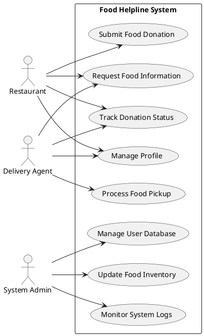
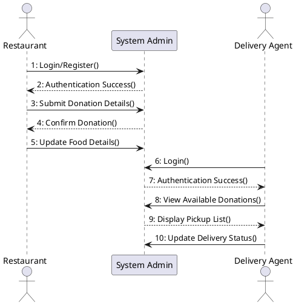
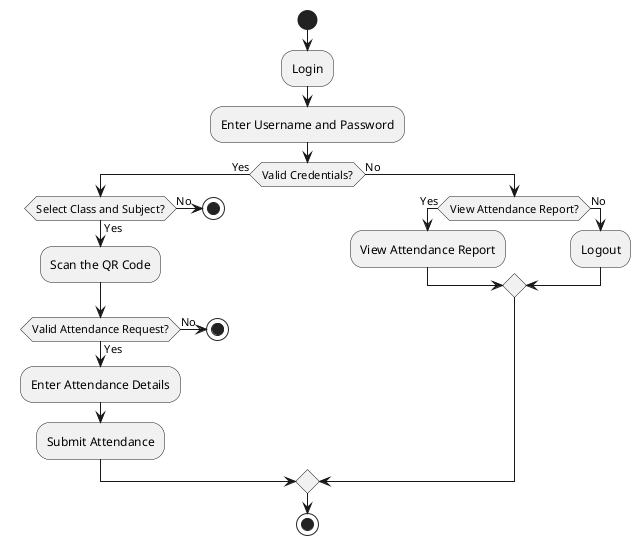
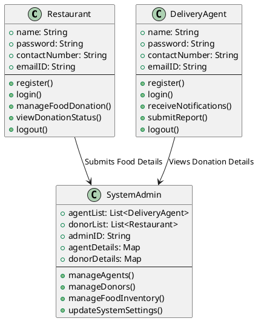
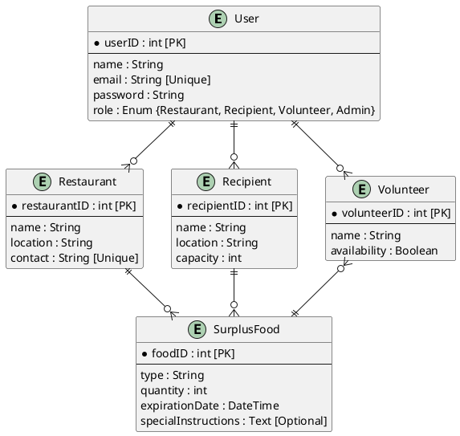
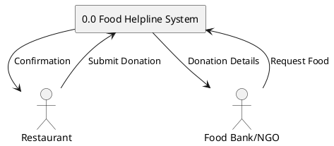
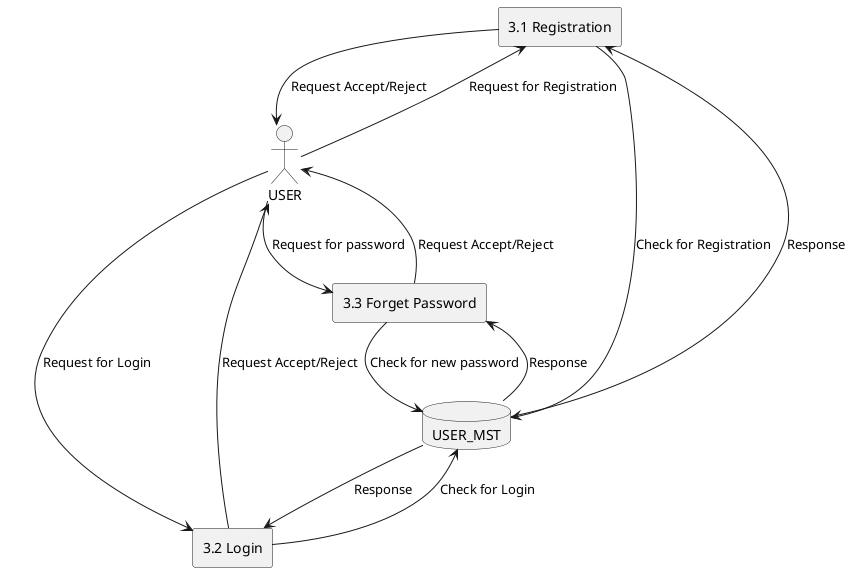
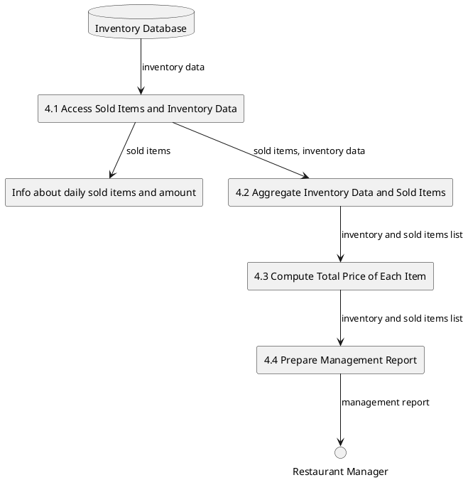

## **UML Diagrams**

#### **Use Case Diagram**



#### **Sequence Diagram**



#### **Activity Diagram**



#### **Class Diagram**



#### **Entity-Relationship (ER) Diagram**



---

#### **Data Flow Diagrams**

##### **Level-0 DFD**



##### **Level-1 DFD**



##### **Level-2 DFD**



&nbsp;
## Example: Entity-Relationship (ER) Diagram

The following ER diagram illustrates the core entities and their relationships in the Food Helpline system. It shows how donors, recipients, food donations, and delivery agents interact within the platform.

```
@startuml
entity "Admin" {
    * admin_id : INT
    --
    username : VARCHAR
    password : VARCHAR
    email : VARCHAR
}

entity "Donor" {
    * donor_id : INT
    --
    name : VARCHAR
    contact_info : VARCHAR
    address : TEXT
}

entity "Food Donation" {
    * donation_id : INT
    --
    food_item : VARCHAR
    quantity : INT
    expiration_date : DATE
    status : ENUM('Pending', 'Accepted', 'Completed', 'Rejected')
}

entity "Recipient" {
    * recipient_id : INT
    --
    name : VARCHAR
    contact_info : VARCHAR
    address : TEXT
}

entity "Request" {
    * request_id : INT
    --
    requested_item : VARCHAR
    quantity_needed : INT
    status : ENUM('Pending', 'Approved', 'Fulfilled', 'Rejected')
}

entity "Pickup/Delivery" {
    * delivery_id : INT
    --
    pickup_time : DATETIME
    delivery_time : DATETIME
}

' Relationships with corrected syntax and cardinality

Admin ||--o{ Donor: "manages"
Admin ||--o{ Recipient: "oversees"
Donor ||--o{ "Food Donation": "makes"
Recipient ||--o{ Request: "submits"
"Food Donation" ||--o| Request: "fulfills"
"Food Donation" ||--o| "Pickup/Delivery": "scheduled_for"

@enduml

```


# checking

Let me thoroughly review each diagram's notation and naming:

1. **Use Case Diagram**
- ✓ Correct name
- ✓ Correct notation (actors, use cases, associations)

2. **Sequence Diagram**
- ✓ Correct name
- ⚠️ Could be improved:
  - Missing activation bars/lifelines
  - Should show message returns more clearly
  - Numbers (1:, 2:, etc.) aren't typical in sequence diagrams

3. **Activity Diagram**
- ✓ Correct name
- ✓ Correct notation (start/stop nodes, activities, forks, decisions)

4. **Class Diagram**
- ✓ Correct name
- ⚠️ Could be improved:
  - Missing proper visibility modifiers (+/-/#)
  - Relationships could be more specific (inheritance, composition, etc.)
  - Missing cardinality on some relationships

5. **"Entity-Relationship (ER) Diagram"**
- ❌ Incorrect name - This is actually using Class Diagram notation
- Should use proper ER notation with:
  - Entities (rectangles)
  - Relationships (diamonds)
  - Attributes (ovals)
  - Proper cardinality notation

6. **Data Flow Diagrams (DFD)**
- ✓ Correct name for the category
- ⚠️ Issues in implementation:
  - Level-0: Missing proper DFD symbols (processes should be circles/rounded rectangles)
  - Level-1: Missing data flows and proper process numbering
  - Level-2: Missing external entities and proper DFD notation

Each diagram type has specific notation standards that should be followed to maintain clarity and conform to industry standards. Would you like me to show how to correct any specific diagram?
